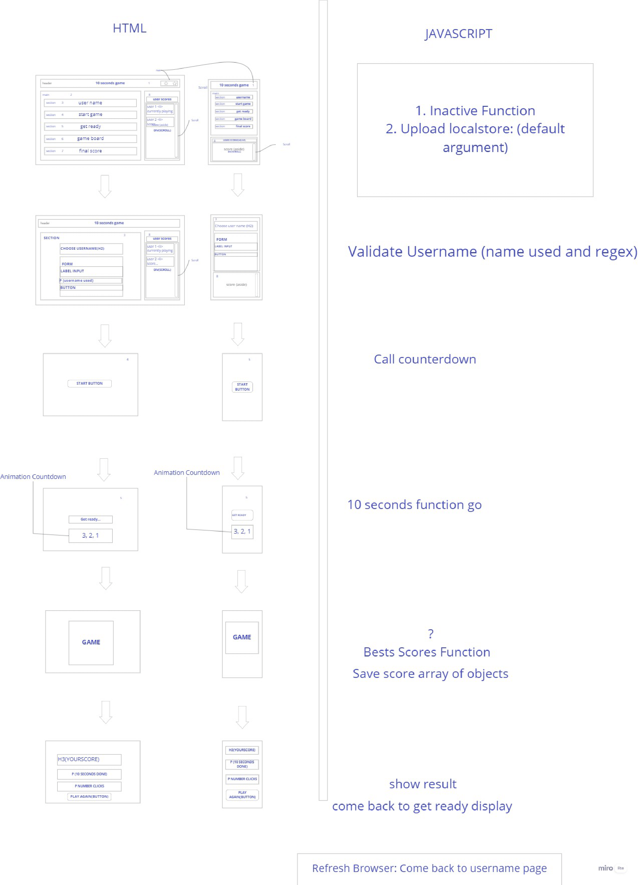
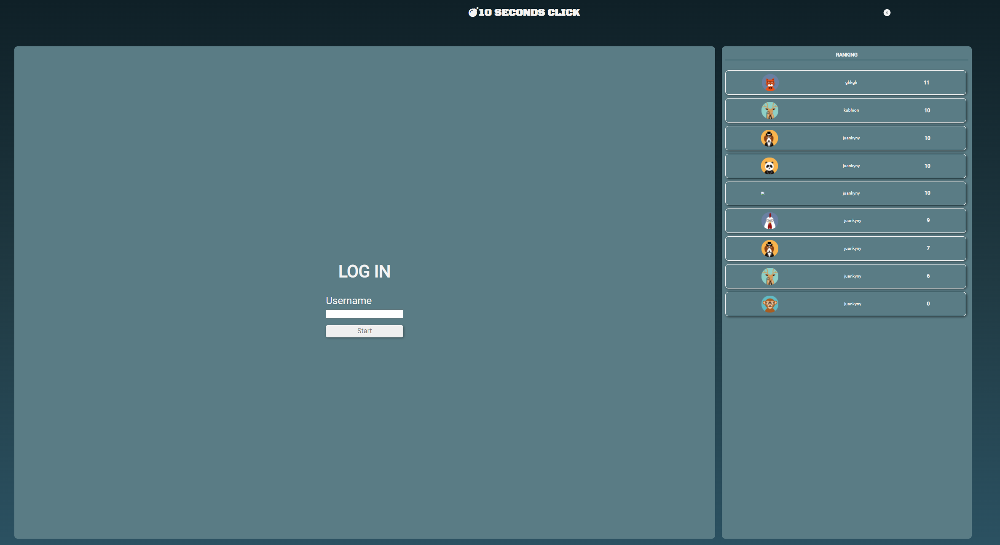
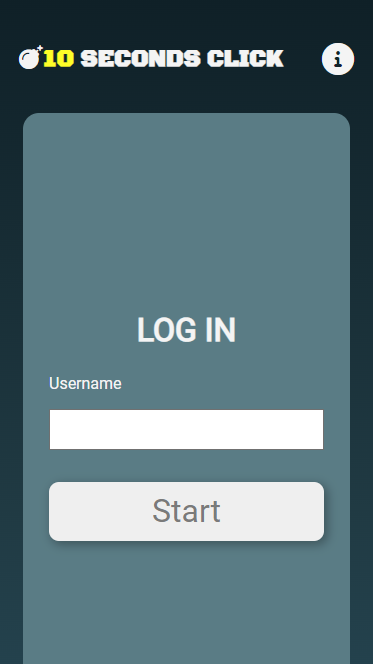
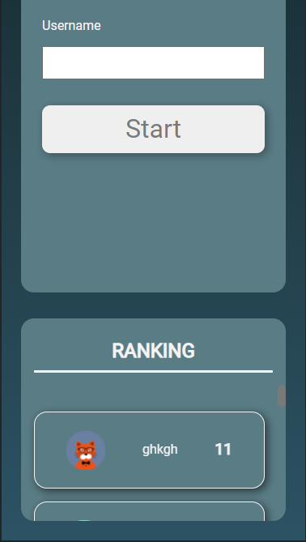
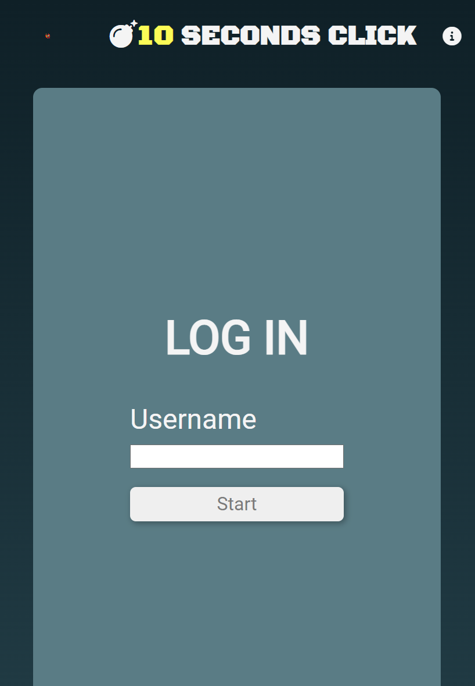
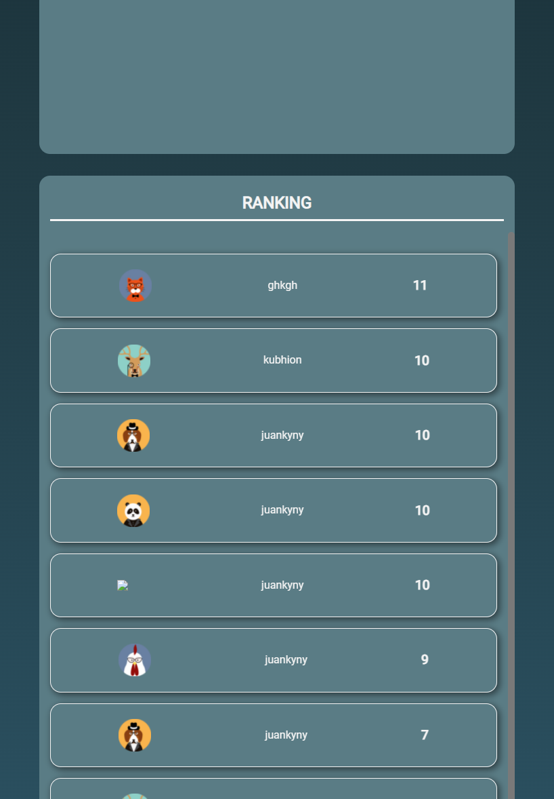

# Play-with-assembler---Team-8

## Contributors

<a href="https://github.com/alicembranos">Alicia Cembranos</a>
<a href="https://github.com/jose-cuevas">José Cuevas</a>
<a href="https://github.com/JcarlosCabello1991">Juan Carlos Cabello</a>

# Ten Seconds Game
The game of ten seconds, consists of the player being able to make the greatest number of clicks in 10 seconds, on an element that is resized and moved around the screen.

## Technologies and organization methods used
HTML5, CSS, JAVASCRIPT, JSON, GIT, BEM, SMACSS.

###### Steps for developing this project
Design of the HTML file.
Development the logical of the game.
Finally, finnish with the definition of the CSS.
The most important aspects and methods used in the developing process:
-Create an initial dashboard to develop the project.
-Another  important point to mention is keeping the peer coding all over the developing process.
-Using the localStorage to storage data
-Array.sort() method to order all the elements of an array
-Array.find() method to find  the first element of an array which satisfies a test function
-Using css variables
-Improve the use of css animations
-Implement the BEM and SMACCS in the project
-Use the import and export in js files.
-Use the “.clientWidth” and “.clientHeight” to obtain the width and height of the element.
-Organising CSS properties properly

###### Steps organization

### Images of PC

### Images of IPHONE

### Images of IPAD

### Video Demo

<video src=".src/assets/audio/demo.mp4" width="600px" height = "340px">

